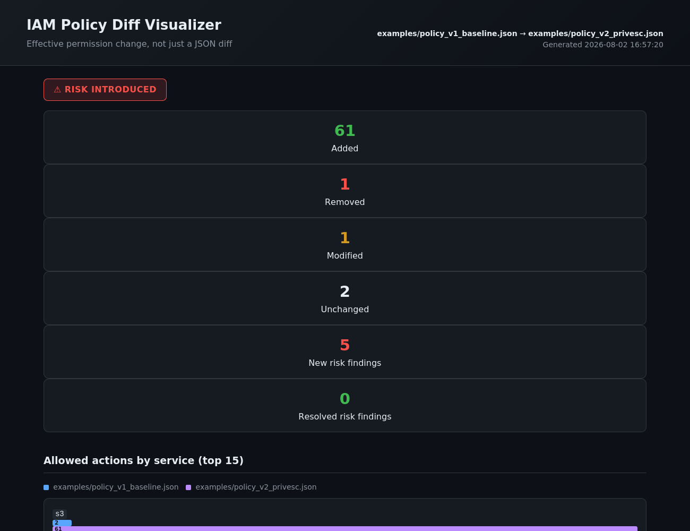
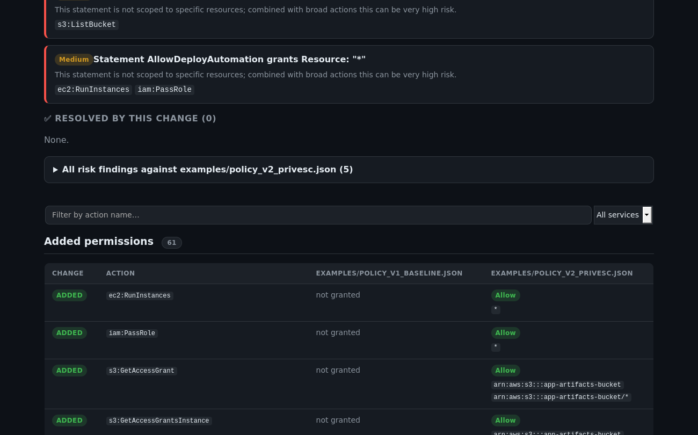
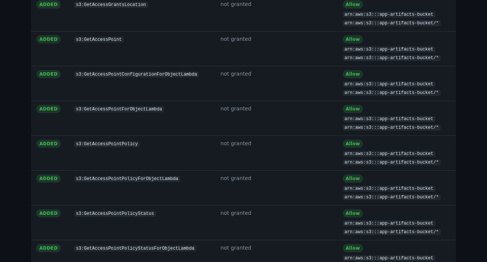

# IAM Policy Diff Visualizer

**Shows the *effective permission change* between two AWS IAM policies — not just a JSON diff.**

[](https://github.com/AshwinNHacker/iam-diff-visualizer/actions/workflows/ci.yml)
[](LICENSE)
[](pyproject.toml)

---

## The problem

`git diff` on two IAM policy files tells you the *text* changed. It does **not** tell you that:

- `"Action": "s3:Get*"` replacing an explicit list of two actions just silently granted **58 additional permissions**
- Widening `"Resource": "arn:aws:s3:::my-bucket/*"` to `"Resource": "*"` just handed out bucket-listing rights account-wide
- Adding `iam:PassRole` next to an existing `ec2:RunInstances` grant just opened a well-known **privilege escalation path**

A code reviewer approving a "small, reasonable-looking" pull request has no way to see any of this from the raw JSON diff. This tool computes the actual **effective grant set** each policy produces, diffs *that*, and flags the security-relevant consequences.

## What it actually does

1. **Parses** the IAM policy document(s) (identity-based, `Version`/`Statement`, `Action`/`NotAction`, `Resource`/`NotResource`, `Condition`).
2. **Expands every wildcard** (`s3:Get*`, `iam:*`, `*`) into the concrete AWS actions it grants, using a catalogue of **6,671 real AWS IAM actions across 79 services**, mined directly from the official `botocore` API definitions (the same source the AWS CLI and SDKs use) — see [`scripts/build_actions_db.py`](scripts/build_actions_db.py).
3. **Computes effective permissions**: for every concrete action, resolves Allow vs. explicit Deny (Deny always wins), and flags any grant that depends on a `Condition` rather than pretending it's unconditional.
4. **Diffs the effective sets**, not the JSON — added / removed / scope-changed / effect-changed / condition-changed, with resource-scope widening called out explicitly.
5. **Runs a security risk ruleset** against both policies — high-risk individual actions (`iam:PassRole`, `iam:CreatePolicyVersion`, `iam:AttachUserPolicy`, …) and known multi-action **privilege-escalation combinations** (`iam:PassRole` + `ec2:RunInstances`, `+ cloudformation:CreateStack`, `+ glue:CreateDevEndpoint`, …), then reports which findings the change **introduces** and which it **resolves**.
6. **Renders a self-contained HTML report** — dark-themed, searchable, filterable by service, zero external dependencies (opens offline, no CDN calls) — plus a machine-readable JSON diff for CI pipelines.

## Screenshots

**Summary + verdict banner**


**Security risk analysis (newly introduced vs. resolved)**


**Effective permission diff table**


Full interactive sample reports (open in a browser): [`docs/sample_report_privesc.html`](docs/sample_report_privesc.html) · [`docs/sample_report_remediation.html`](docs/sample_report_remediation.html)

---

## Install

```bash
git clone https://github.com/AshwinNHacker/iam-diff-visualizer.git
cd iam-diff-visualizer
pip install -e .
```

The core engine and CLI have **zero third-party runtime dependencies** — standard library only. `botocore` is only needed if you want to regenerate the action catalogue, and `flask` only if you want the optional web UI.

## Usage

### CLI

```bash
# Generate an HTML report
iamdiff compare old_policy.json new_policy.json -o report.html

# Machine-readable diff, e.g. for tooling
iamdiff compare old_policy.json new_policy.json --json

# CI gate: exit code 2 if the change introduces new risk findings
iamdiff compare old_policy.json new_policy.json --fail-on-risk -o report.html

# Risk-only scan of a single policy (no comparison)
iamdiff analyze policy.json --fail-on-risk
```

Try it on the bundled example scenario (a policy change that looks innocuous but introduces a classic AWS privilege-escalation path):

```bash
iamdiff compare examples/policy_v1_baseline.json examples/policy_v2_privesc.json -o report.html
```

```
Wrote report.html
  +61 added   -1 removed   ~1 modified   =2 unchanged
  ⚠ 5 new risk finding(s) introduced — see report.
```

And the remediated version, to see resolved risks:

```bash
iamdiff compare examples/policy_v2_privesc.json examples/policy_v3_remediated.json -o remediation.html
```

### As a library

```python
from iamdiff import compare_policies

with open("old.json") as f:
    old = f.read()
with open("new.json") as f:
    new = f.read()

result = compare_policies(old, new)

print(f"{len(result.added)} added, {len(result.removed)} removed, {len(result.modified)} modified")
for risk in result.introduced_risks:
    print(f"[{risk.severity}] {risk.title}")
```

### Web UI (optional)

```bash
pip install -r webapp/requirements.txt
python3 webapp/app.py
# open http://127.0.0.1:5000
```

Paste two policies, click compare, get the same report rendered in-browser. Nothing leaves the local process.

### In CI (policy-change gate)

```yaml
- name: Block privilege-escalating IAM changes
  run: |
    iamdiff compare policies/role.json.old policies/role.json --fail-on-risk -o iam-diff-report.html
- uses: actions/upload-artifact@v4
  if: always()
  with:
    name: iam-diff-report
    path: iam-diff-report.html
```

---

## How the action catalogue is built

Real IAM action names are, for the overwhelming majority of AWS services, identical to the underlying API operation name (`s3:GetObject` ↔ the S3 `GetObject` API call). [`scripts/build_actions_db.py`](scripts/build_actions_db.py) mines every `service-2.json` definition bundled with `botocore` — the same package the AWS CLI and every AWS SDK is generated from — for each service's operation list, maps the botocore service directory to its IAM action prefix (e.g. `monitoring` → `cloudwatch`), and writes the result to [`iamdiff/data/actions_db.json`](iamdiff/data/actions_db.json). A short manually-maintained list patches in the handful of IAM-only actions that have no matching API operation (`iam:PassRole`, `s3:GetObjectVersion`, `sts:TagSession`, etc.).

This is a **documented approximation**, not a claim of byte-for-byte parity with the AWS IAM Service Authorization Reference — regenerate it anytime with:

```bash
pip install -r requirements-dev.txt
python3 scripts/build_actions_db.py
```

## Scope & honesty about what this tool can't do

Real IAM evaluation is request-context-dependent (source IP, MFA presence, session tags, time of day, …) and full ARN-pattern intersection across AWS's many resource grammars is its own deep problem. This tool is built for **policy review**, so it makes two deliberate, clearly-documented simplifications rather than a false claim of runtime-accurate simulation:

1. An explicit `Deny` for an action always overrides an `Allow` for that action, regardless of exact resource-pattern overlap between the two statements — conservative, and both statements are shown so a human can judge resource scope.
2. Any grant that carries a `Condition` is kept (not silently dropped) but flagged **⚠ conditioned** — its real-world effect depends on context this tool doesn't evaluate.

Action patterns for services/actions not present in the catalogue are treated literally and listed under **Unresolved action patterns** in the report rather than silently ignored.

See [`iamdiff/effective_permissions.py`](iamdiff/effective_permissions.py) for the full reasoning, in code comments.

## Project layout

```
iamdiff/                   Core library + CLI
  policy_parser.py          IAM JSON → normalized Statement objects
  actions_db.py             Loads the bundled action catalogue
  expander.py                Wildcard action expansion
  effective_permissions.py  Allow/Deny/Condition resolution per action
  risk_rules.py              Privilege-escalation / high-risk action rules
  differ.py                   Effective-permission diff engine
  report.py                   Self-contained HTML report renderer
  cli.py                      `iamdiff compare` / `iamdiff analyze`
  data/actions_db.json       6,671 real AWS IAM actions (see above)
webapp/                    Optional Flask paste-and-compare UI
examples/                  Sample policies (baseline / privesc / remediated)
scripts/build_actions_db.py Regenerates the action catalogue from botocore
tests/                     45 pytest tests across every module
docs/                      Sample rendered reports + README screenshots
.github/workflows/ci.yml   Matrix tests (Python 3.9–3.12) + CLI smoke test
```

## Testing

```bash
pip install -r requirements-dev.txt
pytest -v
```

45 tests cover policy parsing/validation, wildcard expansion (including the full `"*"` catalogue and unresolved-pattern fallback), effective-permission resolution (Deny-wins, NotAction, condition propagation), the risk ruleset (single actions, escalation combos, wildcard grants), the end-to-end diff engine (including the core claim: two *textually different* policies that expand to the *same* effective grant diff as unchanged), and CLI exit codes for CI gating.

## Roadmap / ideas for extending this

- Resource-policy support (S3 bucket policies, KMS key policies) alongside identity-based policies
- Deeper ARN-pattern intersection instead of the current conservative widening heuristic
- SCP (Service Control Policy) evaluation as an additional constraint layer
- A GitHub Action wrapper for one-line CI adoption

Contributions welcome — the risk ruleset in particular ([`risk_rules.py`](iamdiff/risk_rules.py)) is meant to be extended as new privilege-escalation techniques are published.

## License

MIT — see [LICENSE](LICENSE).
